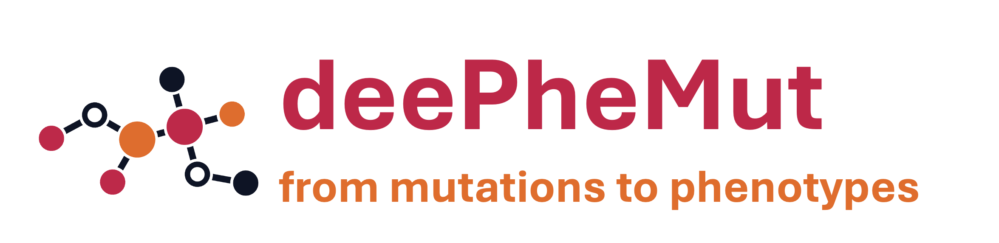

# deePheMut ---- ML & Graph based Tool
## Introduction

- **FROM MUTATIONS TO PHENOTYPES**
- **deePheMut** is an online server tool for distinguishing and predicting inseparable single gene missense mutation multiphenotypic diseases. We will automatically calculate the phenotypic mutation characteristics and use the machine learning framework for model training and interpretation. The final results will be presented in a visual result. We will provide biological indicators that distinguish different disease phenotypes caused by single gene missense mutations and mutation score results to measure the biological significance of the current mutation in this phenotype.
- The deePheMut Server is at: [deePheMut Server](http://106.54.2.54/deePheMut)


# Install
- The deePheMut is linux-based tool, do not use Windows or MacOS
## Installation of Blast tool
1. In order to do blastp, please download ncbi-blast+
```sh
sudo apt get install ncbi-blast+
```
2. Download your local blast database
> In my research, I used uniref50, be sure your server have enough space.
```sh
wget -h https://ftp.uniprot.org/pub/databases/uniprot/uniref/uniref50/uniref50.fasta.gz
```
```sh
unzip uniref50.fasta.gz
```
3. Construct local blast database
```sh
makeblastdb -in uniref50.fasta -dbtype prot
```
## Installation of Clustal Omega and Rate4site
1. Download Clustal Omega
```sh
sudo apt get install clustalo
```
2. Download Rate4site
```sh
sudo apt get install rate4site
```
## Installation of FoldX
1. The FoldX is in https://foldxsuite.crg.eu
2. Please move all the files into deePheMut/mutation folder

## Installation of deePheMut
1. To get the tool, run the following code
```
git clone https://github.com/Spencer-JRWang/deePheMut
```
2. To install the python dependency, run the following code
```
pip install .
```
## Installation of R dependency
1. To install the R base, run the following code
```sh
sudo apt-get install r-base
```
2. Open R console
```sh
sudo R
```
3. Install bio3d
```R
install.packages("bio3d")
```
4. Install igraph
```R
install.pacakges("igraph")
```
5. Install NACEN
```R
install.packages("/your/route/to/NACEN", repos = NULL, type = "source")
```
> You can get NACEN source code at NACEN website: http://sysbio.suda.edu.cn/NACEN

> Or you can get NACEN from [NACEN package](data/NACEN_0.1.0.tar.gz)

# Message

> 📧: spencer-jrwang@foxmail.com
>
> Department of Bioinformatics, Medical School of Soochow University
>
> deePheMut is free for everyone to use, if you have used our tools in your research, please cite: 
