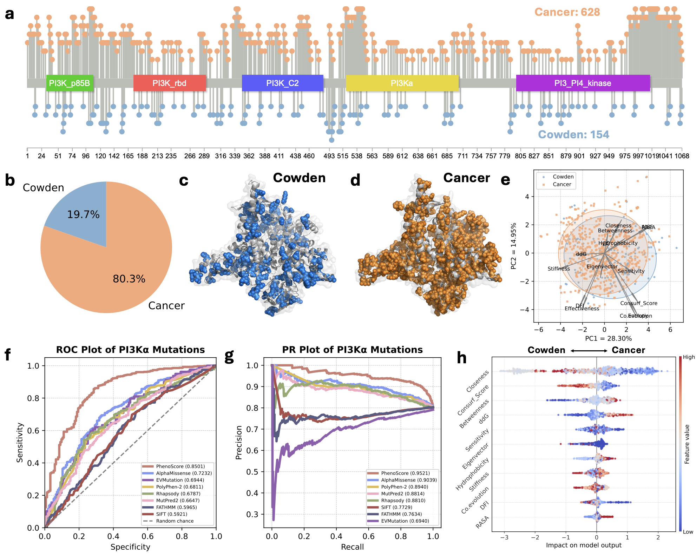

# protPheMut ---- ML & Graph based Tool
## Introduction
- **FROM MUTATIONS TO PHENOTYPES**
- The protPheMut Server is at: **[protPheMut Server](http://106.54.2.54/protPheMut)**
- **protPheMut** is an online server tool for distinguishing and predicting inseparable single gene missense mutation multiphenotypic diseases. We will automatically calculate the phenotypic mutation characteristics and use the machine learning framework for model training and interpretation. The final results will be presented in a visual result. We will provide biological indicators that distinguish different disease phenotypes caused by single gene missense mutations and mutation score results to measure the biological significance of the current mutation in this phenotype.
- More information can be found on **[protPheMut Guide Page](http://106.54.2.54/protPheMut/guide.html)**

## Data
- Protein structure data can be downloaded from the [AlphaFold Database](https://alphafold.ebi.ac.uk) or using your structure file
- Mutation data can be downloaded from public databases: [gnomAD](https://gnomad.broadinstitute.org) and [ClinVar](https://www.ncbi.nlm.nih.gov/clinvar/) etc.

## Links
- ProDy: http://prody.csb.pitt.edu
- FoldX: https://foldxsuite.crg.eu
- NACEN: http://sysbio.suda.edu.cn/NACEN
- Clustal Omega: http://www.clustal.org/omega
- Rate4site: https://www.tau.ac.il/~itaymay/cp/rate4site.html
- Blast: https://blast.ncbi.nlm.nih.gov
- SHAP: https://shap.readthedocs.io/en/latest
- Uniref50: https://ftp.uniprot.org/pub/databases/uniprot/uniref/uniref50

## Features
1. Entropy: measures the mutation frequency on the position
2. Coevolution: coevolution on the position
3. Conservation: conservation score based on rate4site
4. ddG: mutatants folding energy change
5. RASA: single residue's relative exposed area
6. Hydrophobicity: mutation's effect on hydrophobicity
7. Betweenness: mutations' combined global effect on betweenness on a residue
8. Closeness: mutations' combined global effect on closeness on a residue
9.  Eigenvector: mutations' combined global effect on eigenvector on a residue
10. Clustering Coefficient: mutations' combined global effect on eigenvector on a residue
11. Effectiveness: dynamic network features based on ANM
12. Sensitivity: dynamic network features based on ANM
13. DFI: dynamic network features based on GNM
14. MSF: dynamic network features based on GNM
15. Stiffness: dynamic network features based on ANM


# Install
- The protPheMut is linux-based server tool, do not use Windows or MacOS
## Installation and preparasion of Blast tool
1. In order to run blastp, please download ncbi-blast+
```sh
sudo apt get install ncbi-blast+
```
2. Download your local blast database
> In my research, I used uniref50, be sure your server have enough space.
```sh
wget -h https://ftp.uniprot.org/pub/databases/uniprot/uniref/uniref50/uniref50.fasta.gz
```
```sh
unzip uniref50.fasta.gz
```
3. Construct local blast database
```sh
makeblastdb -in uniref50.fasta -dbtype prot
```
## Installation of Clustal Omega and Rate4site
1. Download Clustal Omega
```sh
sudo apt get install clustalo
```
2. Download Rate4site
```sh
sudo apt get install rate4site
```
## Installation of FoldX
1. The FoldX is in https://foldxsuite.crg.eu
2. Please move all the files into protPheMut/mutation folder

## Installation of R dependency
1. To install the R base, run the following code
```sh
sudo apt-get install r-base
```
2. Open R console
```sh
sudo R
```
3. Install bio3d
```R
install.packages("bio3d")
```
4. Install igraph
```R
install.pacakges("igraph")
```
5. Install NACEN
```R
install.packages("/your/route/to/NACEN", repos = NULL, type = "source")
```
> You can get NACEN source code at NACEN website: http://sysbio.suda.edu.cn/NACEN

> Or you can get NACEN from [NACEN package](data/NACEN_0.1.0.tar.gz)

## Installation of protPheMut
1. To get the tool, run the following code
```
git clone https://github.com/Spencer-JRWang/protPheMut
```
2. To install the python dependency, run the following code
```
pip install .
```
> We recommand python 3.10 and independent anaconda environment

# Message

> 📧: spencer-jrwang@foxmail.com
>
> Department of Bioinformatics, Medical School of Soochow University
>
> protPheMut is free for everyone to use, if you have used our tools in your research, please cite: 
> 
> Jingran Wang, Miao Yang, Chang Zong, Gennady Verkhivker, Fei Xiao, Guang Hu. protPheMut: An Interpretable Machine Learning Tool for Classification of Cancer and Neurodevelopmental Disorders in Human Missense Variants. bioRxiv 2025.01.06.631365; doi: https://doi.org/10.1101/2025.01.06.631365

